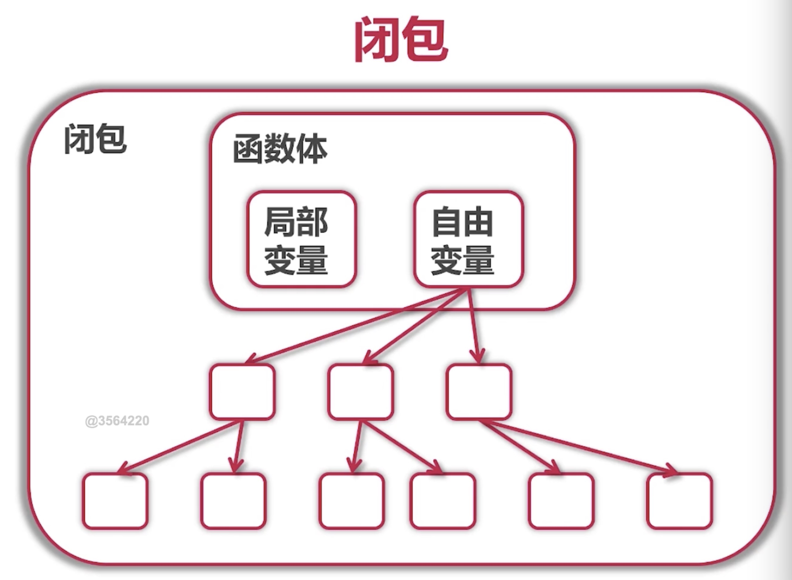

"# learnGo" 

*在用gopath管理依赖时候如果遇到运行报错：*
`can't load package: package learnGo/tree/entry: malformed module path "learnGo/tree/entry": missing dot in first path element` 

请设置go env -w GO111MODULE=off

* GOPATH目录下的src保存的是每一个项目
* GOPATH管理依赖GO111MODULE=off,go mod管理依赖GO111MODULE=on
* go mod管理依赖的时候不需要非得把项目放在gopath的src中

#### warning: go env -w GOPROXY=... does not override conflicting OS environment variable
* 之前设置过环境变量，而go env -w GOPROXY=https://goproxy.cn,direct无法覆盖OS级别的环境变量
* 解决办法：unset GOPROXY，然后在此设置go env -w GOPROXY=https://goproxy.cn,direct即可

##### 扩展已有包
*包需要注意的内容*
- 为结构定义的包必须放在同一个包内
- 可以是不同文件

*如何定义包*
* 定义别名
* 使用组合

##### 把gopath或者vendor管理模块的项目迁移到go mod管理
* go mod init 
* go mod tidy
* 如果想缓存到vendor目录中，go mod vendor

##### 小知识
* curl https://www.imooc.com,curl命令是Linux或者Mac中执行https的一个命令，可以把当前网页的源码给获取下来

##### go接口定义与实现
* go语言的接口由使用者定义
* 接口的实现是隐式的
* 只要实现接口里的方法
* interface的值（实例）里面不仅是简单的值引用，里面也包含类型
* interface的值类型可以通过switch、type assertion来判断；例子见retriever目录下的main
* 接口变量的值可以是值也可以是指针
* 因为接口变量的值可以是指针，所以一般不需要接口的指针
* 指针接受者必须使用指针的方式使用，而值接受可以接受值或者指针
* interface{}代表任何类型，即没有对类型有限制，例如
`var r []interface{}`这个r表示一个可以接受任何类型的slice

##### 系统常用接口
* Stringer,通过改写这个接口可以让使用该封装的接口打印指定格式
* writer/reader 

*自己的理解：接口（interface）是为了方便使用struct中的方法。好处是使用者不需要关心这个struct是谁*

#### 函数式编程
* 函数式一等公民，即变量、参数、返回值都可以式函数
* 正统式函数编程：
    * 不可变形，不能有状态，只有常量和函数
    * 函数只能有一个参数，for,switch都不能要。但是go是一个通用语言，并不需要这么严格
    

*闭包*  


*闭包的应用*
* 可以访问自由变量
* 没有lambda表达式，但是有匿名函数

#### 资源管理和出错处理
*defer的调用*
* 确保在函数结束时发生
* 参数在defer语句时计算
* defer时先进后出即defer语句最后执行的是第一个defer语句

*一般在一下调用defer*  
* Open/Close
* Lock/Unlock
* PrintHeader/PrintFooter

##### 错误处理概念
* 按具体错误情况处理
* 可以自定义error接口中方法`Error() string`的实现
* 错误分为已知和未知，分别处理

#### 文件操作
* sudo cp fib.txt fib2.txt，在管理员权限下创建一个fib2.txt并复制fib.txt中的内容
* cat fib2.txt 查看刚刚常见的文件内容
* sudo chmod 500 fib2.txt ,让fib2.txt文件没有权限，提示500信息，能操作该文件的人需要是root
* ls -l 查看当前目录下文件的操作权限,如果当前的用户身份不是root，那么就没有权限去操作fib2.txt

#### panic（尽量少用）
* 停止当前函数执行
* 一直向上返回，执行每一个defer
* 如果没遇见recover，程序就退出

#### recover
* 仅在defer调用中使用
* 获取Panic的值
* 如果无法处理，可以重新Panic

#### error vs panic
* 意料之中的使用error，即能考虑到的错误就使用error，如文件打不开
* 意料之外的使用panic，如数组越界

#### type assertion:类型断言
* 类型断言就是将接口类型的值(x)，装换成类型(T)。格式为：v,ok:=x.(T)；ok代表类型断言是否合法，如果非法,ok则为false,这样就不会出现panic了
* 类型断言的必要条件就是x是接口类型，非接口类型的x不能做类型断言
* T可以是非接口类型，如果想断言合法，则T应该实现x的接口
* T也可以是接口，则x的动态类型也应该实现接口T

#### 传统测试特点
* 测试数据和测试逻辑混在一起
* 出错信息不明确
* 一旦一个数据出错测试全部结束

#### 表格驱动测试
* 分离测试数据和测试逻辑
* 明确错误信息
* 可以部分出错
* go语言让我们更容易去实现表格驱动测试
* 在命令行进入当前测试文件的目录然后运行go test .即可测试
* 测试文件名在原文件名基础上加上_test即可，例如：main_test.go

#### 代码覆盖率和性能测试
* go test -coverprofile=c.out,命令行中进入测试文件测试覆盖路
* 也可以使用goland编辑器测试
* go tool cover可以显示覆盖率测试可以使用的命令，其中go tool cover -html=c.out可以在网页中显示绿色部分是测试过的代码
* go test -bench . 性能测试；也可以使用goland编辑器测试性能

#### 优化性能测试
* go test -bench . -cpuprofile cpu.ou生成一个cpu.out的性能测试文件
* go tool pprof cpu.out;然后输入web就可以输出一个网页图片查看性能耗时。两个命令就是为了查看cpu.out文件内容
* 如果没有安装graphviz，[graphvi Mac安装方法](https://blog.csdn.net/qq_36847641/article/details/78224910)
* 分析性能慢在哪里，然后优化代码

#### 生成文档
* godoc使用报错：
* go help doc,查看go doc的命令
* go doc go文件名，可以查看该文件的方法；go doc Queue
* godoc -http :6060,然后在本地打开localhost:6060就可以查看代码的文档了。其中包括go自带的库，git，自己项目开发的文档

####示例代码：
* 文件名:queue_test.go
* 方法名Example开头
* fmt.Println输出结果，并且用Output:和期望的结果值来判断是否正确

#### goroutine
* goroutine使用方法就是在函数前面加go关键字，该函数一般使用匿名函数
* goroutine是协程
* goroutine在main中代码执行完成之后就会关闭 
```func main() {
    	for i := 1; i < 10; i++ {
    		go func(i int) {
    			for  {
    				fmt.Printf("我是第%d个函数\n", i)
    			}
    		}(i)
    	}
    
    	//加一个延迟是为了在第一个for结束之后main函数还未结束。该函数不会有输出，因为外层循环次数太少，执行时间过短，里面的匿名函数来不及执行
    	//time.Sleep(time.Millisecond)
    }
```

#### 协程(coroutine)
* 轻量级线程
* 非抢占式多任务处理，由协程主动交出控制权；协程相比较线程消耗资源小
```
//main本身就是一个goroutine，这个main中一个两个goroutine
   func main() {
   	var a [10]int
   	for i := 1; i < 10; i++ {
   		go func(i int) {
   			for  {
   				//fmt.Printf("我是第%d个函数\n", i)
   				a[i]++
   				//交出goroutine的控制权，不然没办法退出
   				runtime.Gosched()
   			}
   		}(i)
   	}
   
   	//加一个延迟是为了在第一个for结束之后main函数还未结束。
   	time.Sleep(time.Millisecond)
   }
```
* 编译器/解释器/虚拟机层面的多任务
* 多个协程可以在一个或者多个线程上运行 
* 这张图片代表的是一个进程，一个进程包含多个线程。线程中包含一个或者多个协程

#### goroutine的定义
* 任何函数加上go关键字就可以交给调度器运行
* 不需要在定义时区分是否为异步函数
* 调度器在合适的点进行切换协程
* 使用-race来访问数据冲突；例如：go run -race goroutine.go

#### goroutine可能的切换点,以下只做参考
* I/O select
* channel
* 等待锁
* 函数调用（有时）
* runtime.Gosched()
* 协程在一台电脑能用多少线程由电脑时几核决定

#### channel
* var c chan int //c:nil，这时c为nil
* channel的接受者必须是goroutine，不然就死锁。发送方可以不是goroutine
* channel是一等公民
* 以下这段代码中<-c起到两个作用，第一个是从chan c中接收数据；第二个是打印出来。如果直接写成fmt.Printf("id:%d,chan:%c\n", id, c),就会无限输出，并且此时的c也不是chan类型
* ```
  func worker(id int, c chan int) {
     	for {
     		fmt.Printf("id:%d,chan:%c\n", id, <-c)
     	}
     }``` 
* chan使用流程就是创建chan；创建接收chan的goroutine；最后往chan中发送数据即可。
* 发送完数据之后关闭chan,必须是发送方去close，close对于性能有好处，避免占用多余的资源;还需要在接收处判断是否还有数据要接受。
* ```close(c)```
* ```
  n ,ok:= <-c
    if ok {
      fmt.Printf("id:%d,chan:%c\n", id, n)
  }
  ```
* 发送完数据之后关闭chan，接收处使用range即可
* ```
  go func() {
     for n:=range c {
     	mt.Printf("id:%d,chan:%c\n", id, n)
     }
  }()
  ```

#### bufferedChannel
* bufferedChannel和一般的channel相比就是创建的时候增加一个缓冲区参数
*   ```c := make(chan int, 3)```
* 缓冲区多大就可以在发送的时候安全的发送多少个数据，超过之后如果没人接收就会出错

#### 使用channel等待任务结束
*方法一：*
* 下面代码会顺序执行
* ```
  for i := 0; i < 10; i++ {
    //发送数据，让接收方去打印，打印了之后返回一个done用来记录是否打印结束
    workers[i].in <- 'a' + i
    //等待接收到workers[i].done的内容才会执行下一次
    <-workers[i].done
  }
  ```
 *方法二：
 * sync.WaitGroup中三个方法：Add()：加入多少任务；Wait()：等待任务执行；Done()：等待任务执行完成
 
 #### 使用select进行调度
 * channel本身是阻塞式的编程，如果不想阻塞可以用select进行调度
 * select中default是非阻塞的，所以有default的时候都会走default
 
 #### 广度优先算法
*广度优先搜索使用队列（queue）来实现，整个过程也可以看做一个倒立的树形：*
* 1、把根节点放到队列的末尾。
* 2、每次从队列的头部取出一个元素，查看这个元素所有的下一级元素，把它们放到队列的末尾。并把这个元素记为它下一级元素的前驱。
* 3、找到所要找的元素时结束程序。
* 4、如果遍历整个树还没有找到，结束程序

#### 广度优先算法在迷宫例子中(maze/maze.go),做了以下几件事
* 用循环创建二维slice
* 使用slice来实现队列
* 用Fscanf来读取文件内容
* 用point对象来抽象

#### http
* 使用http客服端发送请求
* 使用http.client控制请求头部等
* 使用httpUtil简化工作

#### http服务器的性能分析
* import_ "net/http/pprof" ;前面加下环线是告诉程序虽然没用这个模块，但是把这个模块加载进来了
* 访问debug/pprof
* go tool pprof 分析性能;heap看能存使用情况；profile查看性能；例如go tool pprof localhost:8888/debug/pprof/profile

#### 其他标准库
* bufio 读写数据很快
* log
* encoding/json
* regexp
* time
* strings/math/rand
* 如何查看标准库的文档：自己起一个服务，中断输入godoc -http :8888;也可以去中文网看：[golang中文网](http://docscn.studygolang.com/pkg/)

#### 第三方http框架
* gin-gonic/gin
* middleware的使用
* context的使用

#### fmt
* func Fscanf(r io.Reader, format string, a ...interface{}) (n int, err error)；Fscanf 扫描从 r 中读取的文本，并将连续由空格分隔的值存储为连续的实参，其格式由 format 决定。它返回成功解析的条目数

#### go语言排名靠前的爬虫库
* henrylee2cn/pholucs
* gocrawl
* colly
* hu17889/go_spider

#### 爬虫项目简介
* 本项目中不使用第三方爬虫库
* 使用ElasticSearch作为数据存储
* 使用go语言标准模版库实现http数据展示部分

#### 爬虫的法律风险
* robots协议，对方网站的robots协议表明不允许，不能爬取数据。没有禁止爬取也不一定能爬取数据
* 技术上没有约束力
* 法律上作为参考
* 以结果作为导向，用常识来判断
* QPS,爬取速度不能太快。会影响别人网站的正常使用

#### 爬取风险低的网站
* 比较廉价的数据，访问量大的网站：金融、体育、新闻、产品....

#### 单任务爬虫
* 获取bi并打印所有城市第一页用户的详细信息


 