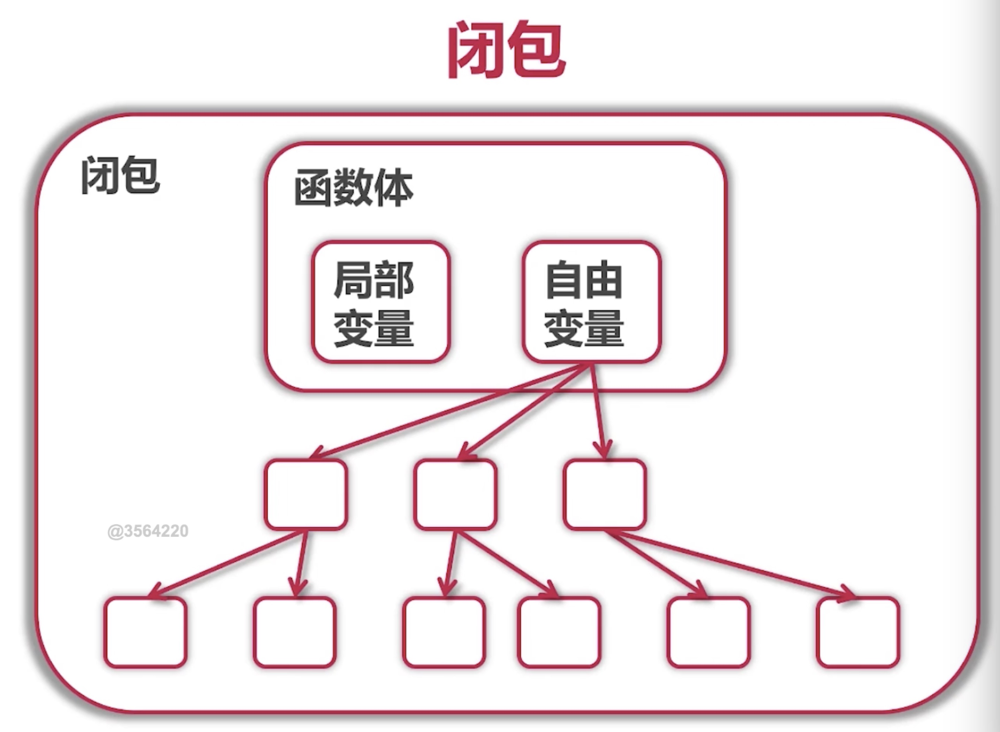

"# learnGo" 

*在用gopath管理依赖时候如果遇到运行报错：*
`can't load package: package learnGo/tree/entry: malformed module path "learnGo/tree/entry": missing dot in first path element` 

请设置go env -w GO111MODULE=off

* GOPATH目录下的src保存的是每一个项目
* GOPATH管理依赖GO111MODULE=off,go mod管理依赖GO111MODULE=on
* go mod管理依赖的时候不需要非得把项目放在gopath的src中

##### 扩展已有包
*包需要注意的内容*
- 为结构定义的包必须放在同一个包内
- 可以是不同文件

*如何定义包*
* 定义别名
* 使用组合

##### 把gopath或者vendor管理模块的项目迁移到go mod管理
* go mod init 
* go mod tidy
* 如果想缓存到vendor目录中，go mod vendor

##### 小知识
* curl https://www.imooc.com,curl命令是Linux或者Mac中执行https的一个命令，可以把当前网页的源码给获取下来

##### go接口定义与实现
* go语言的接口由使用者定义
* 接口的实现是隐式的
* 只要实现接口里的方法
* interface的值（实例）里面不仅是简单的值引用，里面也包含类型
* interface的值类型可以通过switch、type assertion来判断；例子见retriever目录下的main
* 接口变量的值可以是值也可以是指针
* 因为接口变量的值可以是指针，所以一般不需要接口的指针
* 指针接受者必须使用指针的方式使用，而值接受可以接受值或者指针
* interface{}代表任何类型，即没有对类型有限制，例如
`var r []interface{}`这个r表示一个可以接受任何类型的slice

##### 系统常用接口
* Stringer,通过改写这个接口可以让使用该封装的接口打印指定格式
* writer/reader 

*自己的理解：接口（interface）是为了方便使用struct中的方法。好处是使用者不需要关心这个struct是谁*

#### 函数式编程
* 函数式一等公民，即变量、参数、返回值都可以式函数
* 正统式函数编程：
    * 不可变形，不能有状态，只有常量和函数
    * 函数只能有一个参数，for,switch都不能要。但是go是一个通用语言，并不需要这么严格
    

*闭包*  

*闭包的应用*
* 可以访问自由变量
* 没有lambda表达式，但是有匿名函数

#### 资源管理和出错处理
*defer的调用*
* 确保在函数结束时发生
* 参数在defer语句时计算
* defer时先进后出即defer语句最后执行的是第一个defer语句

*一般在一下调用defer*  
* Open/Close
* Lock/Unlock
* PrintHeader/PrintFooter

##### 错误处理概念
* 按具体错误情况处理
* 可以自定义error接口中方法`Error() string`的实现
* 错误分为已知和未知，分别处理

#### 文件操作
* sudo cp fib.txt fib2.txt，在管理员权限下创建一个fib2.txt并复制fib.txt中的内容
* cat fib2.txt 查看刚刚常见的文件内容
* sudo chmod 500 fib2.txt ,让fib2.txt文件没有权限，提示500信息，能操作该文件的人需要是root
* ls -l 查看当前目录下文件的操作权限,如果当前的用户身份不是root，那么就没有权限去操作fib2.txt

